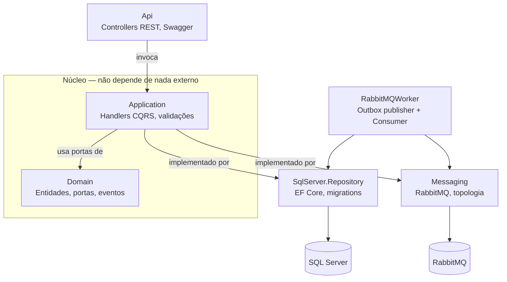
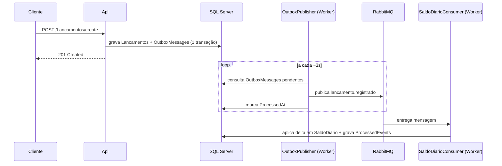

# Opah.BancoCarrefour — Gestão de Fluxo de Caixa

Desafio Técnico - Desenvolvedor de Software. Solução para um lojista gerenciar lançamentos financeiros (créditos e débitos) e consultar o saldo consolidado diário, com a consolidação processada de forma assíncrona e resiliente via RabbitMQ.

## Índice

- [Requisitos do desafio e como foram atendidos](#requisitos-do-desafio-e-como-foram-atendidos)
- [Arquitetura adotada](#arquitetura-adotada)
- [Estrutura de projetos](#estrutura-de-projetos)
- [Pré-requisitos](#pré-requisitos)
- [Como executar localmente](#como-executar-localmente)
- [Endpoints](#endpoints)
- [Fluxo de consolidação assíncrona — quando a fila entra em ação](#fluxo-de-consolidação-assíncrona--quando-a-fila-entra-em-ação)
- [Testes automatizados](#testes-automatizados)
- [Testes manuais](#testes-manuais)
- [Melhorias futuras](#melhorias-futuras)

---

## Requisitos do desafio e como foram atendidos

O enunciado descreve duas necessidades de negócio: uma aplicação para gerenciar lançamentos financeiros, e uma responsável por **fornecer** o saldo diário consolidado. Por isso, `SaldoDiario` é somente leitura via API — a consolidação é calculada automaticamente pelo worker a partir dos lançamentos, e não faz sentido de negócio expor `create`/`update`/`delete` para uma entidade que é derivada, não digitada pelo usuário. Ver [Endpoints](#endpoints) e [Fluxo de consolidação](#fluxo-de-consolidação-assíncrona--quando-a-fila-entra-em-ação).

### Requisitos técnicos obrigatórios

| Exigido | Como foi atendido |
|---|---|
| Linguagem C# | Todo o projeto em C# / .NET 9 |
| Rotinas de testes | `Opah.BancoCarrefour.Tests` (xUnit + Moq) — handlers e validators de Lancamentos e SaldoDiario |
| Clean Code, SOLID, Design Patterns | Arquitetura hexagonal (ports & adapters) + CQRS via MediatR; ver [Arquitetura adotada](#arquitetura-adotada) |
| README com passos de execução, pré-requisitos e funcionamento | Este arquivo |
| Repositório público no GitHub | A publicar pelo candidato |

### Requisitos opcionais atendidos

| Opcional | Como foi atendido |
|---|---|
| Desenho da solução / diagramas de arquitetura | Diagrama de componentes (Mermaid) em [Arquitetura adotada](#arquitetura-adotada); diagrama de sequência do fluxo assíncrono em [Fluxo de consolidação](#fluxo-de-consolidação-assíncrona--quando-a-fila-entra-em-ação) |
| Processamento assíncrono, filas ou mensageria | RabbitMQ com padrão Transactional Outbox — ver abaixo |
| Containers (Docker) | `docker-compose.yml` sobe API, worker, SQL Server e RabbitMQ |

### Requisitos não funcionais

| RNF do enunciado | Como foi resolvido |
|---|---|
| *"A aplicação de gestão de lançamentos precisa continuar operante mesmo em caso de falha no sistema de consolidação diária."* | **Transactional Outbox**: a API grava o lançamento e o evento na mesma transação SQL e nunca abre conexão com o RabbitMQ. Se o RabbitMQ cair, `POST /api/Lancamentos/create` continua respondendo `201` normalmente — só a consolidação atrasa. |
| *"Durante momentos de pico, o sistema de consolidação chega a processar 50 chamadas por segundo, tolerando uma perda máxima de 5%."* | A fila absorve o pico (RabbitMQ processa ordens de grandeza acima disso); retry + circuit breaker (Polly) tratam falhas transitórias; mensagens que não se recuperam vão para uma DLQ em vez de travar as próximas — perda tolerada de forma controlada, não por timeout/crash. |

---

## Arquitetura adotada

O projeto segue arquitetura hexagonal (ports & adapters) com CQRS, organizada em camadas independentes:

```
Opah.BancoCarrefour.Domain              → entidades, portas (interfaces), eventos — não depende de nada
Opah.BancoCarrefour.Application         → casos de uso (Handlers MediatR), regras de validação
Opah.BancoCarrefour.Api                 → adapter de entrada (HTTP/Controllers)
Opah.BancoCarrefour.SqlServer.Repository→ adapter de saída (EF Core / SQL Server)
Opah.BancoCarrefour.Messaging           → adapter de saída (RabbitMQ)
Opah.BancoCarrefour.RabbitMQWorker      → processo separado: publica e consome eventos
Opah.BancoCarrefour.IoC                 → composição/injeção de dependência da API
Opah.BancoCarrefour.Tests               → testes unitários (xUnit + Moq)
```

O Domain define portas (`ICommand<T>`, `IQuery<T>`, `ILancamentoOutboxCommand`, `IEventPublisher`, `IOutboxRepository`, `ISaldoDiarioConsolidacaoRepository`) e nunca depende de EF Core, RabbitMQ ou ASP.NET Core — essas dependências entram só nos adapters (`SqlServer.Repository`, `Messaging`), que implementam as portas.



### Decisão central: Transactional Outbox + Event-Driven Architecture

1. Ao criar um lançamento, o `CreateLancamentosHandler` grava **na mesma transação** (um único `SaveChanges`) a linha em `Lancamentos` **e** uma linha em `OutboxMessages` contendo o evento serializado (`lancamento.registrado`).
2. A API devolve `201 Created` assim que esse commit termina. **Ela nunca abre conexão com o RabbitMQ.**
3. Um processo separado — `Opah.BancoCarrefour.RabbitMQWorker` — é quem publica de fato. Ele roda dois `BackgroundService`:
   - **`OutboxPublisherBackgroundService`**: faz *polling* na tabela `OutboxMessages` a cada poucos segundos, publica as mensagens pendentes no RabbitMQ e marca como processadas. Se o RabbitMQ estiver fora do ar, a mensagem simplesmente continua pendente e é retentada no próximo ciclo — nada se perde.
   - **`SaldoDiarioConsolidadorConsumer`**: consome a fila `saldo-diario.consolidacao`, aplica o delta (crédito ou débito) no `SaldoDiario` do dia correspondente, e grava um marcador de idempotência (`ProcessedEvents`) na mesma transação.

### Resiliência no Worker: Retry + Circuit Breaker (Polly)

- **Retry**: até 3 tentativas com backoff exponencial para falhas transitórias (timeout de rede, deadlock momentâneo).
- **Circuit Breaker**: se as falhas persistirem (≥50% de falha numa janela de 30s, com no mínimo 5 chamadas), o circuito abre e passa a rejeitar chamadas imediatamente por 30s — evitando martelar uma dependência já sabidamente indisponível.
- **Dead Letter Queue**: mensagens que esgotam o pipeline de resiliência vão para `saldo-diario.consolidacao.dlq` (nack sem requeue), em vez de ficar reprocessando infinitamente ou travando as próximas mensagens da fila.

### Idempotência

Cada evento de lançamento só é aplicado uma vez ao saldo do dia por consumidor: antes de consolidar, o consumer verifica `ProcessedEvents` (chave única `EventoId + ConsumerName`). Isso protege contra reprocessamento em caso de redelivery do RabbitMQ.

---

## Estrutura de projetos

| Projeto | Responsabilidade |
|---|---|
| `Opah.BancoCarrefour.Domain` | Entidades (`LancamentosEntity`, `SaldoDiarioEntity`, `OutboxMessageEntity`, `ProcessedEventEntity`), enums, eventos, portas |
| `Opah.BancoCarrefour.Application` | Handlers MediatR para Lancamentos (Create/Update/Delete/Get/List) e SaldoDiario (Get/List), validators (FluentValidation) |
| `Opah.BancoCarrefour.Api` | Controllers REST, Swagger, Program.cs |
| `Opah.BancoCarrefour.SqlServer.Repository` | DbContext, implementações EF Core das portas, migrations |
| `Opah.BancoCarrefour.Messaging` | Conexão RabbitMQ, publisher, declaração de topologia (exchange/fila/DLX) |
| `Opah.BancoCarrefour.RabbitMQWorker` | Processo standalone: `OutboxPublisherBackgroundService` + `SaldoDiarioConsolidadorConsumer` |
| `Opah.BancoCarrefour.IoC` | Composição de dependências da API |
| `Opah.BancoCarrefour.Tests` | Testes unitários dos handlers e validators |

---

## Pré-requisitos

- Docker e Docker Compose
- (Opcional, para desenvolvimento fora do container) .NET 9 SDK

## Como executar localmente

```bash
docker compose up -d --build
```

Isso sobe 4 containers:

| Serviço | Porta | Descrição |
|---|---|---|
| `sqlserver` | 1433 | SQL Server 2022 |
| `rabbitmq` | 5672 (AMQP), 15672 (painel) | RabbitMQ com plugin de management |
| `api` | 8080 | API REST — aplica as migrations automaticamente no startup |
| `rabbitmq-worker` | — | Publisher do Outbox + Consumer de consolidação |

Painel do RabbitMQ: [http://localhost:15672](http://localhost:15672) (usuário/senha: `guest`/`guest`)
Swagger da API: `http://localhost:8080/swagger`

A API roda a migration do banco automaticamente ao iniciar (`app.ApplyMigrations()` em `Program.cs`); o worker não roda migration, apenas conecta ao banco já migrado pela API — por isso o `docker-compose.yml` garante que o worker só sobe depois da API.

---

## Endpoints

**`LancamentosController`** (`/api/Lancamentos`)
- `POST /create` — registra um lançamento (crédito ou débito)
- `PUT /update` — atualiza um lançamento existente
- `DELETE /delete?id={guid}` — remove um lançamento
- `GET /get/{id}` — busca por Id
- `GET /list?pageNumber=&pageSize=` — lista paginada

**`SaldoDiarioController`** (`/api/SaldoDiario`) — **somente leitura**
- `GET /get/{id}` — busca um saldo consolidado por Id
- `GET /list?pageNumber=&pageSize=` — lista paginada

Não há `create`/`update`/`delete` para `SaldoDiario` por decisão de design: o saldo é uma entidade derivada, consolidada automaticamente pelo `SaldoDiarioConsolidadorConsumer` a partir dos lançamentos (ver seção abaixo). Expor CRUD manual permitiria sobrescrever um valor que deveria ser sempre o resultado do cálculo, contradizendo a própria consolidação delta-based/idempotente do worker.

---

## Fluxo de consolidação assíncrona — quando a fila entra em ação

É importante entender que a consolidação **não é instantânea** — ela é assíncrona por design (é exatamente isso que atende os requisitos não funcionais do desafio).



A linha do tempo típica de um `POST /api/Lancamentos/create`:

| Momento | O que acontece | Onde observar |
|---|---|---|
| T+0s | API grava `Lancamentos` + `OutboxMessages` (mesma transação) e responde `201` | Tabela `Lancamentos` já tem a linha; `OutboxMessages` tem a linha com `ProcessedAt = NULL` |
| até T+3s | `OutboxPublisherBackgroundService` faz polling (intervalo de 3s) e publica no RabbitMQ | `OutboxMessages.ProcessedAt` passa a ter timestamp; painel do RabbitMQ mostra a mensagem passando pela fila `saldo-diario.consolidacao` |
| quase imediato após a publicação | `SaldoDiarioConsolidadorConsumer` já está com `BasicConsumeAsync` ativo — não faz polling, é orientado a evento. Assim que a mensagem chega na fila, o callback dispara | Logs do worker: `"[SaldoDiarioConsolidadorConsumer]"` |
| — | Consumer aplica o delta no `SaldoDiario` do dia (cria a linha se não existir) e grava `ProcessedEvents` | Tabela `SaldoDiario` atualizada; `ProcessedEvents` com uma nova linha |

**Ou seja: o tempo total esperado entre o `POST` e o `SaldoDiario` refletir o lançamento é de até ~3-5 segundos**, dominado pelo intervalo de polling do publisher (o consumo em si é praticamente instantâneo). Se você consultar `GET /api/SaldoDiario/list` logo após o `POST`, é esperado que o saldo ainda não reflita o lançamento mais recente — espere alguns segundos e consulte de novo.

Esse delay é uma escolha consciente de trade-off: polling simples (em vez de, por exemplo, notificar o publisher a cada escrita via `SqlDependency`/CDC) para manter a implementação simples e previsível dentro do prazo do desafio. Ver [Melhorias futuras](#melhorias-futuras).

---

## Testes automatizados

```bash
dotnet test
```

Cobre, via xUnit + Moq, os handlers de Create/Update/Delete/Get/List de Lançamentos e Get/List de SaldoDiario, e os validators (FluentValidation) de criação — casos de sucesso e de validação/erro.

## Testes manuais

A pasta [`scripts/`](./scripts) na raiz do repositório contém 2 arquivos com payloads de teste, em formatos diferentes conforme a ferramenta que você preferir usar:

| Arquivo | Como usar |
|---|---|
| [`scripts/requests.http`](./scripts/requests.http) | Compatível com o REST Client nativo do Visual Studio/VS Code — abre o arquivo e clica em "Send Request" acima de cada bloco, um por vez |
| [`scripts/cadastrar-lancamentos.ps1`](./scripts/cadastrar-lancamentos.ps1) | Script PowerShell que dispara todos os `POST`s automaticamente, um atrás do outro, com a API já no ar (`.\scripts\cadastrar-lancamentos.ps1`, com o Docker Compose já rodando) |

O `cadastrar-lancamentos.ps1` traz 25 lançamentos de teste, espalhados por vários dias, misturando crédito/débito e valores pequenos/grandes/decimais quebrados — incluindo 2 casos propositalmente inválidos (valor zero e descrição vazia) para exercitar a validação. O `requests.http` traz 10 cenários originais mais comentados, um por um, cobrindo:

| Cenário | O que valida |
|---|---|
| Crédito/débito simples, hoje | Caminho feliz |
| Segundo crédito/débito, mesmo dia | Acumulação correta no `SaldoDiario` (não sobrescreve) |
| Lançamento em dia anterior | Consolidação usa a **data do lançamento**, não a data de processamento — gera/atualiza uma linha diferente em `SaldoDiario` |
| Valor alto (R$ 5.000,00) | `decimal(18,2)` sem overflow/truncagem |
| Valor com centavos (R$ 19,99) | Arredondamento/precisão decimal |
| Inválido — valor zero / descrição vazia | Retorna `400`, nada é gravado (nem `Lancamentos` nem `OutboxMessages`) |

O `requests.http` também traz duas consultas de apoio (`GET /list` de Lançamentos e de SaldoDiario) para conferir o resultado depois de rodar os POSTs.

### Testando resiliência manualmente

- **Rabbit fora do ar**: `docker stop` no container do RabbitMQ, dispare um `POST /create` — deve continuar respondendo `201` normalmente. O lançamento é gravado, o evento fica pendente em `OutboxMessages` (acompanhe `TentativasEnvio` subindo e os logs de retry). Suba o RabbitMQ de novo — a consolidação completa sozinha, sem intervenção.
- **Circuit Breaker**: como ele exige um volume mínimo de falhas (`MinimumThroughput = 5` em 30s) para abrir, um teste com 1-2 mensagens tende a mostrar só o retry agindo. Para ver o circuito abrir de fato, é necessário gerar várias falhas seguidas em um intervalo curto (ex.: manter o RabbitMQ ou o SQL Server fora do ar enquanto várias mensagens tentam processar).
- **DLQ**: publique manualmente uma mensagem com JSON inválido direto na fila `saldo-diario.consolidacao` pelo painel do RabbitMQ — após esgotar o pipeline de retry, ela deve aparecer em `saldo-diario.consolidacao.dlq`.

---

## Melhorias futuras

Itens conscientemente deixados de fora do escopo, documentados aqui conforme sugerido no enunciado do desafio:

- **Notificação em vez de polling no OutboxPublisherBackgroundService**: hoje o publisher verifica a tabela `OutboxMessages` a cada poucos segundos. Uma evolução seria eliminar esse delay usando um mecanismo de notificação (ex.: `SqlDependency`, Change Data Capture, ou um segundo canal leve de "acordar o publisher" logo após o commit).
- **Concorrência no consumer**: o `SaldoDiarioConsolidadorConsumer` processa mensagens sequencialmente (uma por vez) por design, o que evita condições de corrida no incremento do saldo sem precisar de lock otimista. Para escalar horizontalmente com múltiplas instâncias do worker consumindo a mesma fila, o incremento do saldo precisaria virar um `UPDATE` atômico (`ExecuteUpdateAsync`) ou usar controle de concorrência otimista (`RowVersion`).
- **Update de Lançamento via CRUD manual**: o handler de `Update` faz um "overwrite" completo do registro a partir do que veio na requisição, sem buscar o estado atual antes. Funciona porque o validator exige todos os campos, mas não há controle de concorrência (`RowVersion`) contra edições concorrentes.
- **Entidades de domínio mais ricas**: `LancamentosEntity`/`SaldoDiarioEntity` hoje são modelos anêmicos (bags de propriedades); as regras de negócio vivem inteiramente no FluentValidation da camada de Application. Uma evolução natural seria mover invariantes básicas (ex.: `Valor > 0`) para dentro da própria entidade.
- **Endpoint de consulta por data**: hoje o `SaldoDiarioController` só busca por Id. Um `GET /api/SaldoDiario/data/{data}` seria mais natural para o caso de uso real do lojista do que buscar por Guid.
